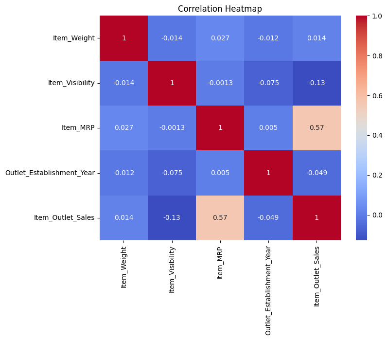

      # 1.Prediction-of-Product-Sales

## 2.Project 1 - Part 2 (Core): Loading Data, Data Cleanin, Missing Values

## 3.Project 1 - Part 3 (Core): exploratory visuals that might help you understand your data

### Sales Distribution

Most products have lower sales, while a smaller number have high sales.

---

##3 Correlation Heatmap

This heatmap shows that Item_MRP has a moderate positive correlation with sales.

