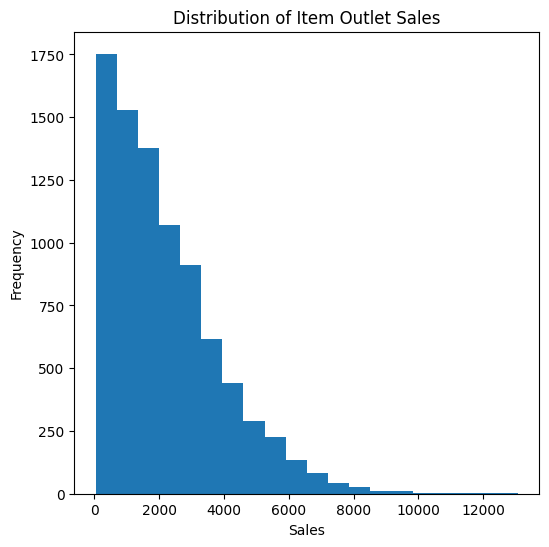

  # Prediction of Product Sales

## Overview

This project aims to predict product sales using machine learning techniques. The objective is to help retailers understand which product and store characteristics have the greatest impact on sales performance and support better business decisions.

## Business Problem

Retailers need to understand which product and outlet characteristics contribute to higher sales in order to improve inventory planning and business decisions.

---

## Data

The dataset contains information about products and outlets, including item characteristics, outlet information, and sales values.

Features include:

- Item Weight
- Item Visibility
- Item MRP
- Outlet Type
- Outlet Establishment Year

Target:
- Item_Outlet_Sales

---

## Methods

- Data cleaning
- Handling missing values
- Exploratory Data Analysis (EDA)
- Data preprocessing
- Model training and evaluation

---

## Results

### Visualization 1: Distribution of Product Sales

The sales distribution is positively skewed, meaning most products generated lower sales values while only a limited number achieved very high sales. This suggests that a small group of products contributes heavily to total sales.

---

### Visualization 2: Correlation Between Features and Sales

Item_MRP showed the strongest positive relationship with sales (0.57), indicating that product price is one of the most influential factors affecting sales performance, while other numerical features showed weak relationships.

## Model

The final selected model was the tuned Random Forest Regressor after optimizing the hyperparameters using GridSearch.

Evaluation metrics on the test data:

- R² Score = 0.602
- RMSE = 1047.383
- MAE = 729.285

The tuned Random Forest model improved performance compared to the default model and explained approximately 60% of the variation in product sales. This makes it a suitable model for supporting sales prediction and business decision-making.

## Recommendations

Based on the analysis and model results, retailers should focus on product and outlet characteristics that have the greatest impact on sales performance. Since Item_MRP showed the strongest relationship with sales, pricing strategies and product selection can be optimized to improve overall sales performance. Additionally, using predictive models can support inventory planning and business decision-making.

## Limitations & Next Steps

This project has some limitations, including the available dataset size and the limited number of features used for prediction. Future improvements may include testing additional machine learning models, applying advanced feature engineering techniques, and collecting more data to improve prediction accuracy and model performance.

### For Further Information

See the notebook and repository documentation for additional project details and implementation steps.
